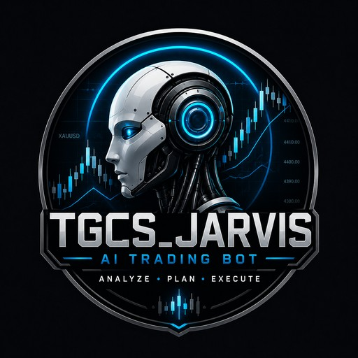
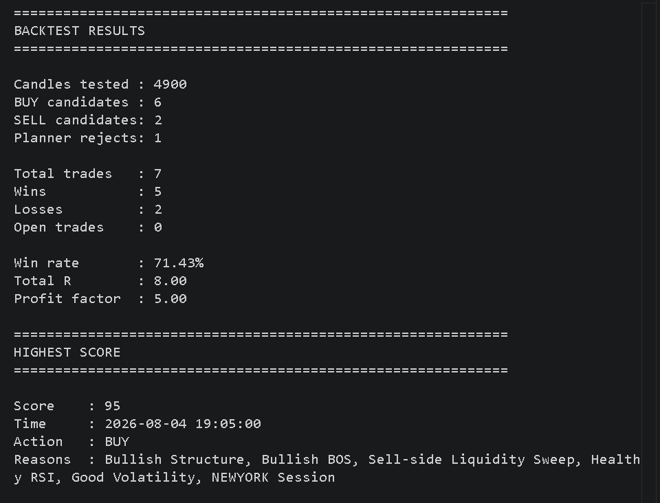

<p align="center">
  
</p>

<h1 align="center">TGCS Trader AI</h1>

<p align="center">
  AI-powered XAUUSD trading automation and analysis system
</p>

TGCS Trader AI is a Python-based trading automation project built around MetaTrader 5 and designed for XAUUSD analysis, trade planning, risk management, and systematic backtesting.

> **Status:** Active development and demo testing
> **Repository:** Public showcase
> **Core trading engine:** Kept private

## What It Does

TGCS Trader AI combines multiple market-analysis components to evaluate potential XAUUSD setups and generate structured trade plans.

The system currently includes:

* Market structure analysis
* Break of Structure (BOS) detection
* Liquidity and liquidity-sweep detection
* Order Block detection
* Fair Value Gap (FVG) detection
* RSI and ATR analysis
* Trading-session analysis
* Automated entry planning
* Stop-loss and take-profit calculation
* Risk-based position sizing
* MetaTrader 5 integration
* Historical backtesting
* Out-of-sample validation
* Live demo-market monitoring
* Demo trade execution testing

## System Architecture

```text
Market Data
     │
     ▼
Market Analysis
     │
     ├── Structure
     ├── BOS
     ├── Liquidity
     ├── Liquidity Sweeps
     ├── Order Blocks
     ├── FVG
     ├── RSI
     └── ATR
     │
     ▼
Signal Scoring
     │
     ▼
AI Decision Engine
     │
     ▼
Trade Planner
     │
     ├── Entry
     ├── Stop Loss
     └── Take Profit
     │
     ▼
Risk Management
     │
     ▼
MetaTrader 5
```

## Backtesting

The project is tested against historical XAUUSD M5 data using progressively larger samples.

### Current 5,000-Candle Historical Backtest

The latest historical test processed 5,000 candles, with 4,900 candles used in the final trade evaluation.

Results:

* **7 completed trades**
* **5 wins**
* **2 losses**
* **71.43% win rate**
* **+8.00R total result**
* **5.00 profit factor**
* **6 BUY candidates**
* **2 SELL candidates**
* **1 planner rejection**
* **0 open trades at test completion**

### Backtest Results



These results are historical simulations and are **not a guarantee of future performance**. The sample size is still limited and further testing is required.

## Out-of-Sample Validation

A separate unseen section of historical data is used to reduce the risk of evaluating the system only on the data used during development.

Previous validation results:

* **6 trades**
* **4 wins**
* **2 losses**
* **66.67% win rate**
* **+6R**
* **4.00 profit factor**

The validation sample remains small, so additional forward testing is required.

## Risk Management

The system supports percentage-based risk management and evaluates:

* Account balance
* Risk percentage
* Stop-loss distance
* Position size
* Maximum structural risk
* Broker volume limits
* Spread conditions
* Open-position limits
* Duplicate-position protection

The current development configuration uses a 1% risk model for testing.

## Demo Forward Testing

The project is currently being tested on a MetaTrader 5 demo environment.

The live monitoring engine can:

* Watch XAUUSD
* Process new M5 candles
* Detect developing setups
* Generate trade plans
* Produce sound alerts
* Test demo execution
* Manage multiple demo positions within a configured limit
* Monitor live balance and equity
* Apply spread checks

The production strategy and proprietary implementation remain private.

## Technology

* Python
* MetaTrader 5
* Pandas
* Technical-analysis components
* Custom market-structure detection
* Risk-management engine

## Development Roadmap

* Expand forward demo testing
* Increase statistical sample size
* Improve execution reliability
* Add stronger trade journaling
* Expand risk controls
* Continue prop-firm compatibility research
* Build additional reporting and monitoring tools
* Add more polished monitoring and performance dashboards

## Disclaimer

TGCS Trader AI is a software-development and research project.

Historical backtests and simulated results do not guarantee future trading performance. Trading financial markets involves substantial risk, and automated systems can experience losses, technical failures, data issues, execution differences, and unexpected market conditions.

## Project

**TGCS Trader AI**
Built and maintained by **TGCS**
